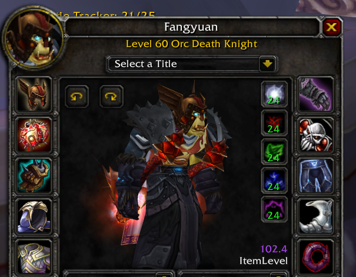
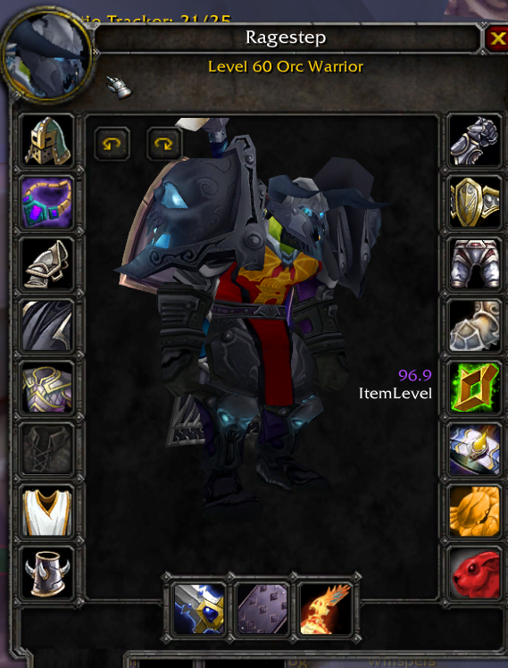
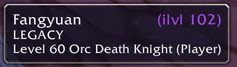

# Itemlevel

Shows average equipped item level on the character panel, the inspect frame, and player mouseover tooltips (WotLK 3.3.5a).

Open your character window (`C`) and your average item level appears in the top-left area of the paper doll. Inspect another player and their average shows in the same spot on the inspect window. Mouse over a player within inspect range and `ilvl N` appears to the right of their name in the tooltip. The value is color-coded:

- White below 55
- Green at 55+
- Blue at 70+
- Purple at 90+

The thresholds are the `COLOR_TIERS` table at the top of `Itemlevel.lua` if you want different ones. The value updates when you open the character panel, change equipment, or while an inspect window is open. Gear data for other players arrives from the server with a short delay, so inspect and tooltip values fill in within a second; tooltip values are remembered per player for the session. Shirt and tabard are excluded from the average.

## Screenshots

## Changes vs the original

- v1.2.1: tooltip format drops the parentheses (`ilvl 102` instead of `(ilvl 102)`).
- v1.2: average item level on player mouseover tooltips, shown right of the name (inspect range required, values cached per player for the session).
- v1.1: inspect-frame support; fixed an error when items are not yet in the local item cache (common on fresh login and when inspecting); fixed NaN display with no equipped items; no more global namespace leaks; color thresholds retuned (green 55+, blue 70+, purple 90+; the original used 180/200/219).

## Credit

This addon was written by **ZpiXDK**, released on the Warmane forums on Feb 12, 2023:

- Forum thread: https://forum.warmane.com/showthread.php?t=454723
- Original download: https://mega.nz/file/soB0kaSb#VbKi_QInVH19_P9pp4idL9TARz_hnWtr7FFuOi6hvBg

This repository is a maintained fork. All credit for the original addon goes to ZpiXDK. If you are the original author and want this fork changed or taken down, open an issue.

## Install

1. Download the latest `Itemlevel-vX.Y.zip` from [Releases](../../releases).
2. Extract it into `Interface\AddOns\` inside your 3.3.5a client folder, so you end up with `Interface\AddOns\Itemlevel\Itemlevel.toc`.
3. Restart the game or run `/reload`.

Works on any WotLK 3.3.5a client.
